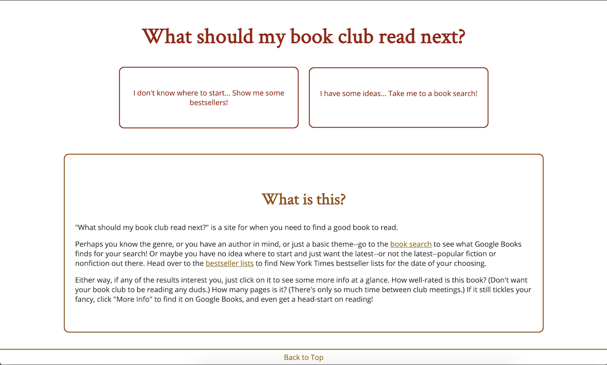
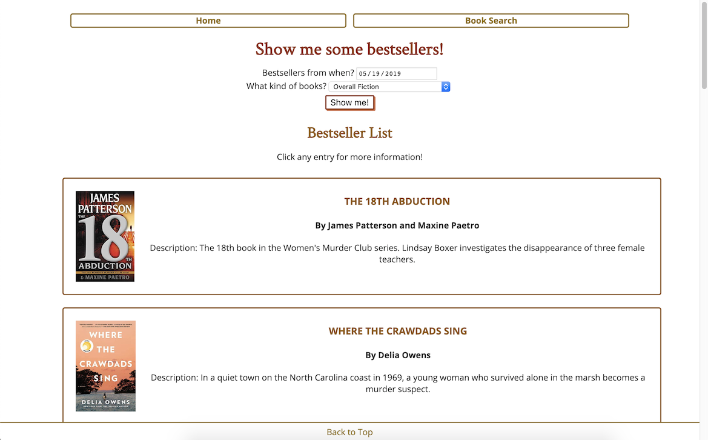
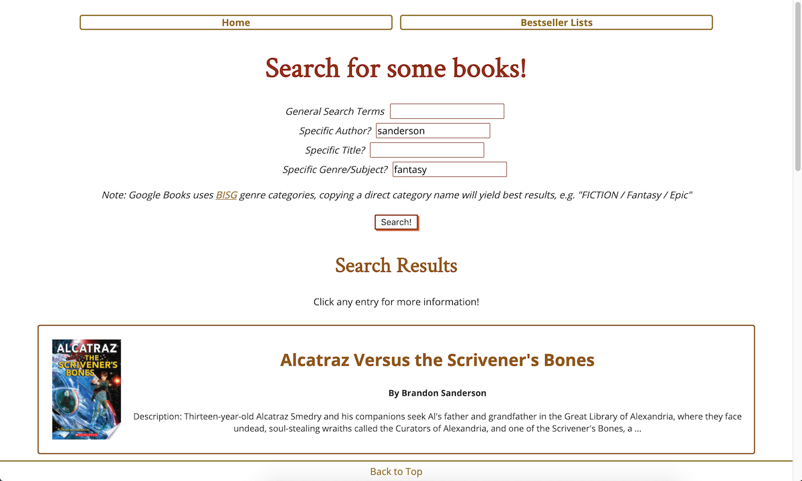
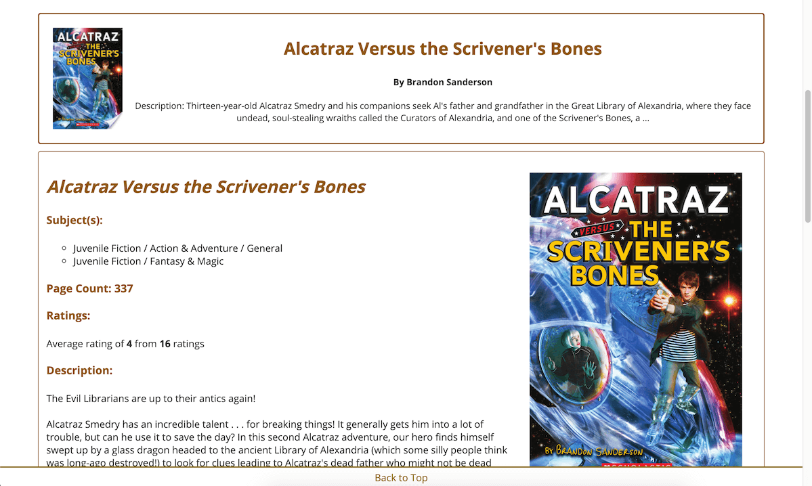

# What Should My Book Club Read Next?

A quick tool for settling on a great book to read--either by perusing bestseller lists, or by searching for a book that interests you.

Don't know where to start? Look through New York Times bestseller lists for fiction or nonfiction, current or past, to get some popular suggestions.
Have some ideas? Search through Google Books extensive results on keyword, title, author, or genre to see a number of targeted search results.

While looking through your results, click any book for more detailed information (ratings, page count, genre, full description), and for an external link to the Google Books page for that title.

## Link

[Live Demo](https://carmarsden.github.io/book-club-next-book/)

## Screenshots

#### Landing Page:

#### View a Bestseller List:

#### View Book Search Results:

#### See More Info on a Title:

## Technology

### Built with:
* HTML & CSS
* JavaScript
* jQuery

### API Interfaces:
* [Google Books](https://developers.google.com/books/)
* [New York Times Books](https://developer.nytimes.com/docs/books-product/1/overview)